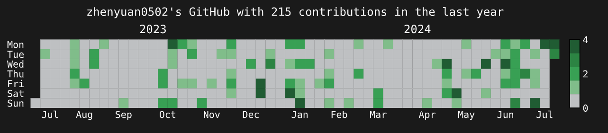
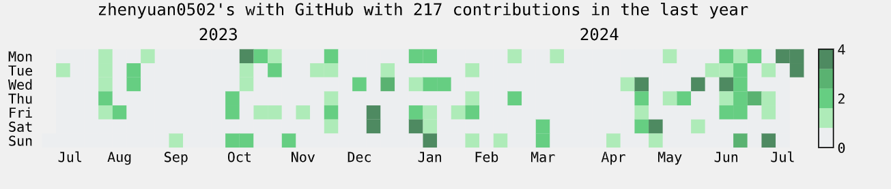

# DevChart

DevChart is a Flask-based web application designed to visualize coding activity from platforms like GitHub and LeetCode. It generates statistical charts that represent a user's coding contributions over time, offering both JSON data and SVG visuals. You can use these charts to showcase your coding progress, share your achievements, or analyze your coding habits on your own blog or website.

Inspired by [githubchart-api](https://github.com/2016rshah/githubchart-api) and [githubchart](https://github.com/akerl/githubchart) developed on Ruby, I ported it to Python Flask to support more features and platforms. E.g dark and light mode depending on user preference, and more platforms...

The reason I chose Python Flask is that it is more lightweight and easier to deploy than Ruby on Rails. It is also more familiar to me, as a Data Engineer, Python would have more styles and libraries, such as matplotlib, pandas, etc,... to have more elegant and customizable charts.

## Snapshot
### Dark mode:

### Light mode:


## Features

- **GitHub Contribution Chart**: Visualize your GitHub contributions in a calendar heatmap.
- **LeetCode Submission Chart**: Get insights into your LeetCode submission in a calendar heatmap.
- Supports output in both JSON and SVG formats for easy integration and sharing.

## Roadmap
- (In-Progress) Deploy to user own GitHub Actions for automatic updates. Then you can use the generated SVG link directly
- Support more platforms like Codeforces, AtCoder, etc.
- Customizable chart styles and colors.

## Getting Started

### Prerequisites

- Developed in Python 3.11.9. For lower please help check compatibility. 
- pip (Python package installer)

### Local Installation

1. Clone the repository to your local machine:

```
git clone https://github.com/zhenyuan0502/DevChart.git
```

2. Run `init.ps1` to install the required Python packages as well as .env
3. Run `run.ps1` or `F5` to start the local Flask server on `http://localhost:5000`
4. Use the following endpoints to generate coding activity charts

```
GitHub
- `http://localhost:5000/api/github/<username>/svg` to get GitHub contribution chart data in light mode
- `http://localhost:5000/api/github/<username>/svg?theme_mode=dark` to get GitHub contribution chart data with dark theme
- `http://localhost:5000/api/github/<username>/svg?mode=test&theme_mode=dark` to simulate GitHub contribution chart data with dark theme
- `http://localhost:5000/api/github/<username>/json` to get GitHub contribution chart data in JSON format

The same with LeetCode:
- `http://localhost:5000/api/leetcode/<username>/svg` to get LeetCode submission chart data
- `http://localhost:5000/api/leetcode/<username>/json` to get LeetCode submission chart data in JSON format
```
5. Deploy to your own server or cloud service to share your coding activity with others! I would gladly ask for web-host sponsorship if you have one :)

### GitHub Action for automatic updates after period of time (In-Progress)

For some reason, if you don't have a server to host the application, you can use GitHub Actions to update the chart automatically after a period of time. Since the chart is less change and mostly depending on your frequent coding activity, you can set the update time to be daily, weekly, or monthly in the GitHub Actions workflow.


### Used libraries:
- Flask
- July (customized) https://github.com/e-hulten/july
- Calmap https://github.com/MarvinT/calmap/

## Contributing

Contributions are welcome! Feel free to submit a pull request or open an issue if you have any suggestions or ideas for improvement.

## License
Under MIT License.

For you information, this README is mostly written by GitHub Copilot, as well as coding part :)